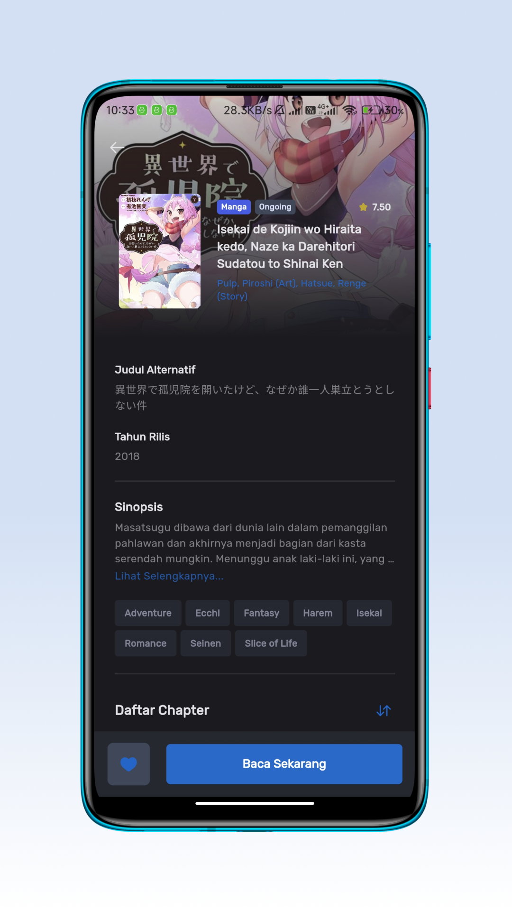
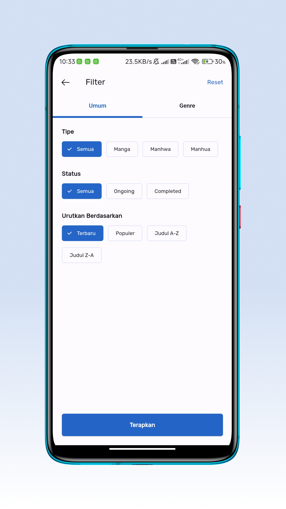
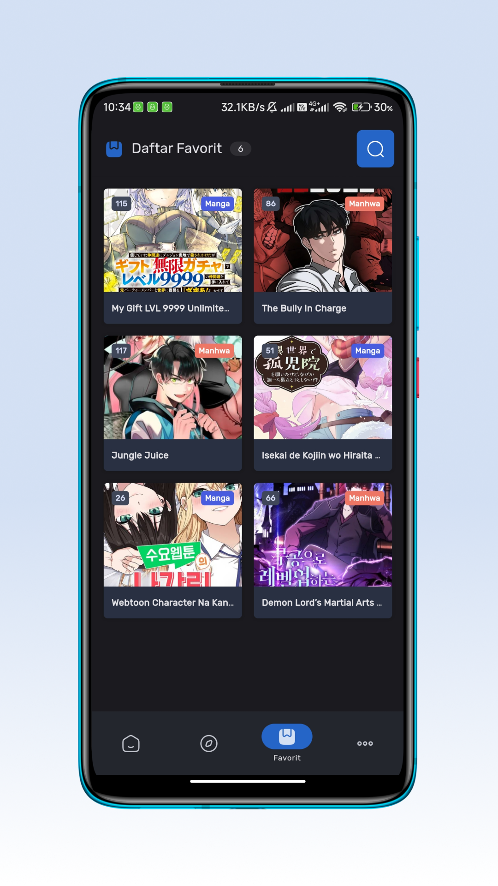
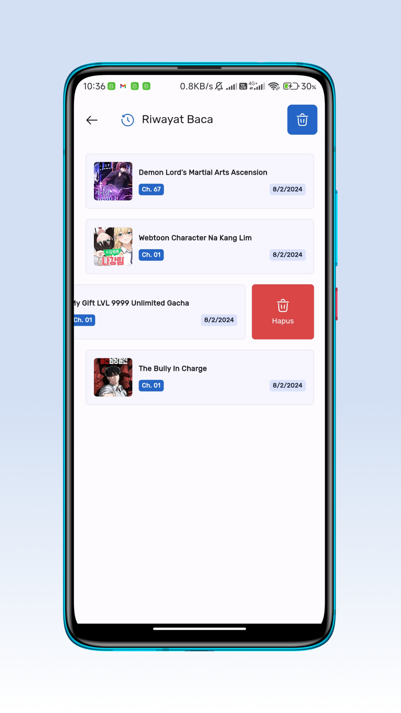
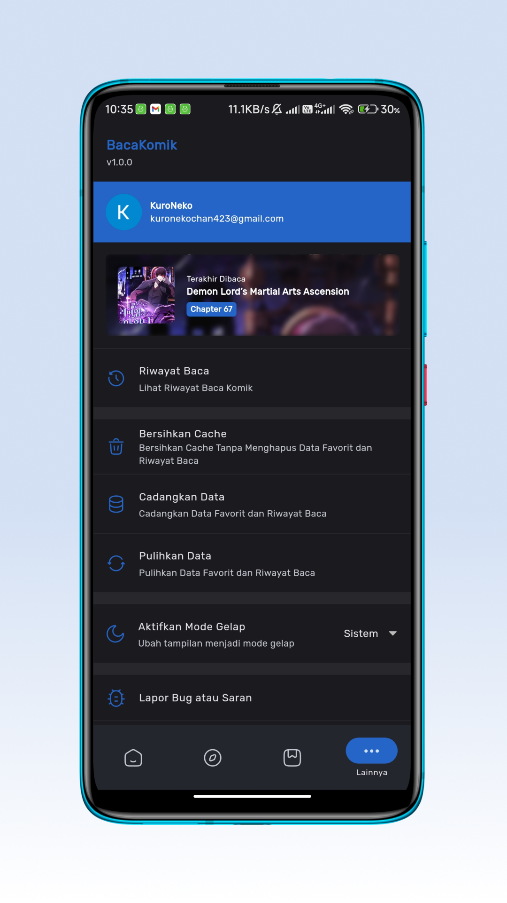

# BacaKomik App

Read Comic Application created using Flutter.

## Screenshot

## Download

## Bug Report

If you find a bug you can report it to me by writing new issue in https://github.com/sofyan-rs/bacakomik-app-release/issues/new
